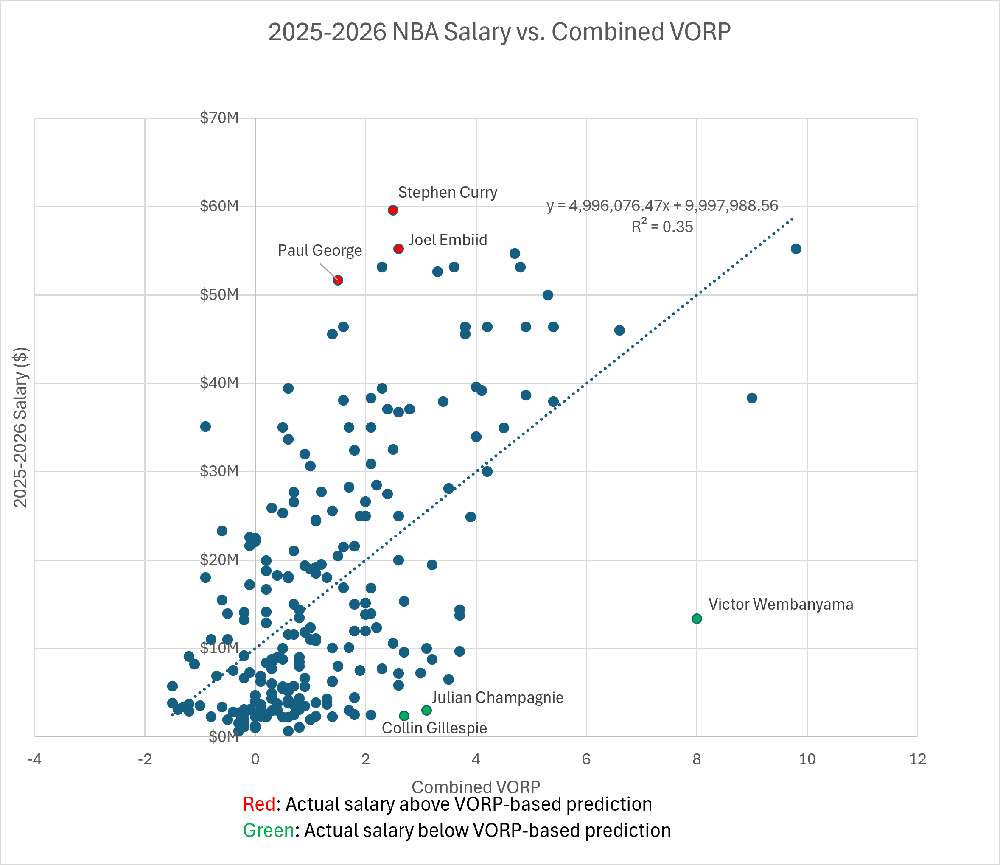
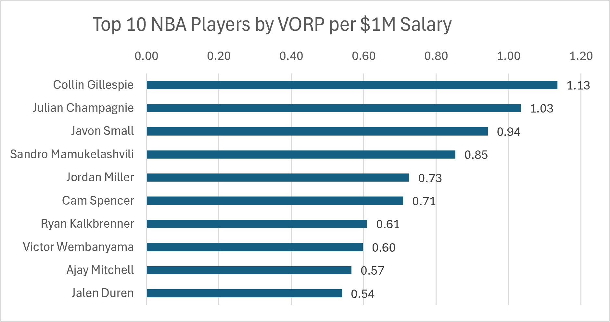

# NBA Player Salary Value Analysis

## Overview

For this project, I wanted to see how NBA player salaries compare to their performance during the 2025–26 season. I used Excel to combine player salary data, game-by-game stats, and VORP (Value Over Replacement Player) data into one analysis.

I focused on two main questions: how strongly is player performance related to salary, and which players are producing the most value for the amount they are being paid?

For the main analysis, I only included players who played at least 40 games and averaged at least 20 minutes per game. I used this filter so players with very limited playing time would not have a large effect on the results.

## Tools & Skills

- Microsoft Excel
- Data cleaning and preparation
- PivotTables
- XLOOKUP and SUMIF
- Data visualization
- Correlation and linear regression

## Data

I combined three types of data for the 2025–26 NBA season:

- **Player statistics:** Game-by-game player performance data, including points, rebounds, assists, steals, blocks, minutes played, and games played.
- **Player salaries:** 2025–26 salary data used to compare player compensation with performance.
- **VORP:** Regular-season and playoff Value Over Replacement Player data used as the main overall performance metric.

Because the datasets came from different sources, I cleaned player names and matched players across the datasets before performing the analysis. Players without a matching salary record were excluded from salary-based calculations.

## Key Metrics

**VORP (Value Over Replacement Player):** VORP estimates a player's overall contribution compared with a replacement-level player. A replacement-level player is roughly the level of player a team could acquire relatively easily to fill a roster spot. Higher VORP represents more estimated on-court value, while a negative VORP represents performance below replacement level.

For this project, I used both regular-season and playoff VORP:

**Combined VORP = Regular Season VORP + Playoff VORP**

I combined the two because my player performance data also includes both regular-season and playoff games.

**VORP per $1M Salary:** I created this metric to compare how much VORP a player produced relative to their salary.

**VORP per $1M = Combined VORP / (Salary / 1,000,000)**

For example, a VORP per $1M of 1.00 means the player produced 1.00 VORP for every $1 million in salary. Higher values indicate more VORP produced relative to salary.

**Predicted Salary:** I used a linear regression with Combined VORP as the independent variable (X) and salary as the dependent variable (Y).

**Predicted Salary = Intercept + (Slope × Combined VORP)**

This estimates salary based only on the relationship between VORP and salary in the qualified player sample.

**Salary Residual:** I calculated the difference between each player's actual salary and the salary predicted by the regression.

**Salary Residual = Actual Salary - Predicted Salary**

A positive residual means the player's actual salary was above the model's prediction, while a negative residual means it was below the prediction.
## Analysis & Results

### Salary vs. VORP

I used a linear regression to look at the relationship between Combined VORP and player salary for players who met the 40-game and 20-MPG requirements.

The regression produced the following equation:

**Predicted Salary = $9,997,988.56 + ($4,996,076.47 × Combined VORP)**

This means that within this model, each additional point of Combined VORP is associated with about $5.0 million in additional salary.

The model had an **R² of 0.35**, meaning Combined VORP explains about 35% of the variation in salary among the qualified players in this dataset.

This also shows that VORP alone does not explain most of the differences in NBA salaries. Factors that are not included in this model can also affect salary, so I use the predicted salaries and residuals as comparisons rather than estimates of what a player should actually be paid.

The scatterplot shows a positive relationship between VORP and salary, but there is still a lot of variation around the regression line. I also highlighted several players with large differences between their actual salary and the salary predicted by the model.
### Top 10 Players by VORP per $1M Salary

I also compared players using VORP per $1M of salary to see which players produced the most VORP relative to how much they were paid.

This comparison only includes players who met the same requirements of at least 40 games played and 20 minutes per game.

### What Stood Out to Me

A few players stood out to me when I looked at both parts of the analysis.

Stephen Curry, Joel Embiid, and Paul George had some of the largest positive salary residuals, meaning their actual salaries were much higher than what the VORP-based model predicted. This does not necessarily mean they were overpaid. Their salaries reflect factors that my model does not include, and missed games can also lower a player's season-long VORP.

Victor Wembanyama stood out in the opposite direction. He recorded a Combined VORP of 8.0 while earning about $13.4 million, resulting in an actual salary much lower than the model's prediction. One important factor is that Wembanyama was still playing under his rookie-scale contract during the 2025–26 season, which limits his salary compared with what established veteran stars can earn. He also ranked in the Top 10 for VORP per $1M.

The VORP per $1M results also highlighted players who may not have the largest salaries or highest overall VORP totals. Collin Gillespie ranked first at 1.13 VORP per $1M, followed by Julian Champagnie at 1.03. Their relatively low salaries combined with strong VORP made them the two highest-ranked players by this measure.

Looking at both charts showed me that total performance and salary efficiency tell different parts of the story. A player can have a very high VORP without ranking first in VORP per $1M, while a lower-salary player can provide strong production relative to their cost.
## Limitations

There are several limitations to this analysis that are important when interpreting the results.

- VORP is only one measure of player performance and does not capture every part of a player's impact.
- The regression only uses Combined VORP to predict salary. NBA salaries are also influenced by factors such as contract timing, experience, past performance, injuries, role, and contract rules.
- My performance data includes both regular-season and playoff games, meaning players who made the playoffs had additional opportunities to add to their Combined VORP.
- I used a minimum of 40 games and 20 minutes per game for the main analysis. These are filters I selected to focus on players with meaningful playing time, not official NBA qualification requirements.
- Players without a matching 2025–26 salary record in the salary dataset were excluded from salary-based calculations.

Because of these limitations, the salary residuals should not be interpreted as a definitive measure of whether a player is overpaid or underpaid.
